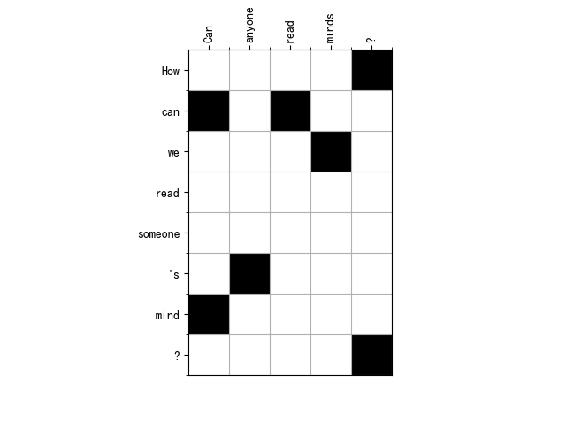

# align_sym_plot
Symmetry and visualization for GIZA ++ word alignment resluts. 

After we get the GIZA++ output file like xxx.A3.final (see my blog: [使用 GIZA++ 进行词对齐]())，we can symmetrize and visualize them via following script.

# Symmetry

```python
python align_sym.py a2b.A3.final b2a.A3.final > aligned.grow-diag-final-and
```

where a2b.A3.final and b2a.A3.final are your own xxx.A3.final files.

After this, you will obtain the symmetry file aligned.grow-diag-final-and, which looks like:

```
1-5 2-1 2-3 3-4 6-2 7-1 8-5
1-7 2-1 2-3 3-5 3-6 4-6 5-1 5-2 6-2 7-7
```

# Visualization

Then, we can visualize the symmetry file via align_plot.py.

```python
python align_plot.py text_a.txt text_b.txt aligned.grow-diag-final-and 0

"""
Get visualization picture for the first sentence pair 
"""
```

which may looks like:



# Reference

[使用GIZA++进行词对齐](https://blog.csdn.net/guolindonggld/article/details/79626609)